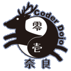
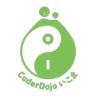

# メンターさん用連絡ページ

## このページについて
発足以来の大人メンターさん以外に、学生メンターさんの参加も増えてきてFacebookだけでは連絡が取れなくなってきましたので、誰もが見られるところということで、本ページを作成しました。以後、各種連絡用使っていきます。

## 連絡事項

### 7月のDojoについて
7月の奈良のDojoは、通常通り第二土曜日だと7月9日になるのですが、WordCamp Kanasai 2016の日程と重なっていて、私がこちらに参加しないといけないため、第三土曜日の7月16日（土）開催とさせていただきます。申しわけありませんが、予定していただけると助かります。

### 8月のDojoについて
8月は、お盆休みと重なることや会場確保の都合もあって、8月はどちらのDojoも開催しません。

### 「DojoCon Japan 2016」について
8月にCoderDojoコミュニティ主催のイベント「[DojoCon Japan 2016](http://dojocon.coderdojo.jp)」が開催されます。良かったら、参加をお願いします。お手伝いしてくださる方も募集しています。

### LINEグループ作ります
当日の急な連絡などを手軽にできるように、LINEグループを作成します。
[こちらのリンク](http://line.me/ti/p/ntTEDTWBj4)をクリックするか、以下のQRコードからコンタクトを送ってください、随時グループ2追加していきます。

## 出欠確認

[メンターさんの出欠確認用に調整さん](https://chouseisan.com/s?h=8107e928473a4c2daebceaba245ccdd8)を立てています、こちらの入力をお願いします。

## 次回開催予定

### CoderDojo奈良

- 7月16日（土）
- Women's Future Center[地図](https://goo.gl/maps/aaGef3yemVw)

タイムテーブル

|時間|内容|
|:--:|:--:|
|12:30〜13:00|開場・受付|
|13:00〜13:10|イントロダクション|
|13:10〜14:30|活動時間|
|14:30〜15:00|発表タイム|
|15:00〜15:30|撤収・掃除|

### CoderDojo生駒

- 7月30日（土）
- 生駒市市民活動推進センター「ららポート」[地図](https://goo.gl/maps/XzJa49bSmAw)

タイムテーブル

|時間|内容|
|:--:|:--:|
|13:00〜13:30|開場・受付|
|13:30〜13:40|イントロダクション|
|13:40〜15:30|活動時間|
|15:00〜16:00|発表タイム|
|16:30〜17:00|撤収|
